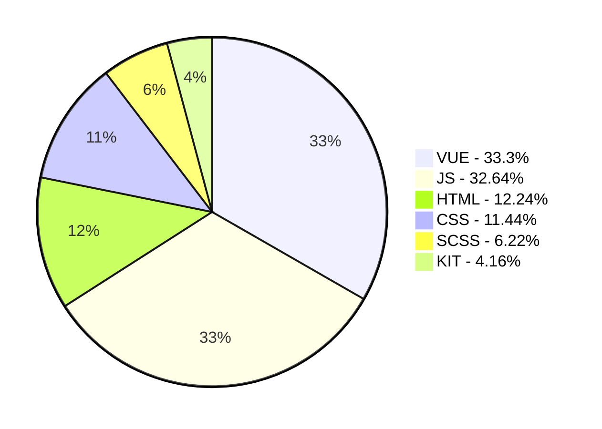

 -   Hi, I’m **@lifewithoutalcohol**
- I’m interested in learning and work with **Vue**. 
- I’m currently learning **Vue / Vuex** and i love it so much
- I’m looking to collaborate with smart team, where i can grow like a frontend developer and find someth interesting things in programming
- You can write to me on email: **denispopovich1996@gmail.com**

<!---
lifewithoutalcohol/lifewithoutalcohol is a ✨ special ✨ repository because its `README.md` (this file) appears on your GitHub profile.
You can click the Preview link to take a look at your changes.
--->

    
